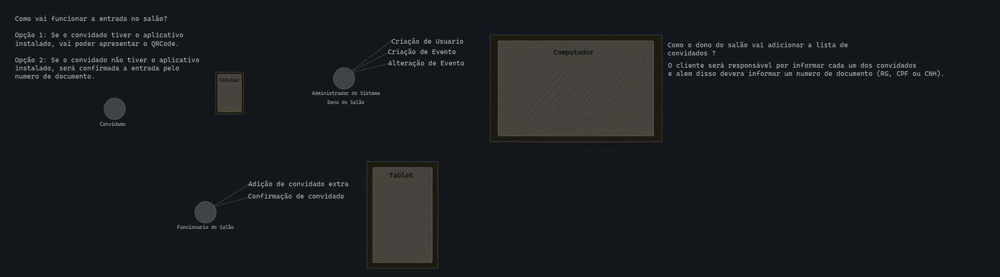

### LIST VIEW ADMIN APP

## Objetivo do projeto

Codigo com o projeto front-end que ira interagir com o backend em NEST-JS para realizar as funções administrativas.

## Tecnologias Utilizadas
- Vue 3.4.34
- HTML
- CSS
- [Primevue](https://primevue.org/introduction/)

### Fluxos
- Criar cadastro da empresa ( Salao de festa )
- Listar festas
- Cadastrar festas
- Listar convites
- Cadastrar convites

## Apos clonar o projeto

Para instalar as dependencias

    npm install

## Como rodar o projeto

Para iniciar o projeto front end:

    npm run dev
